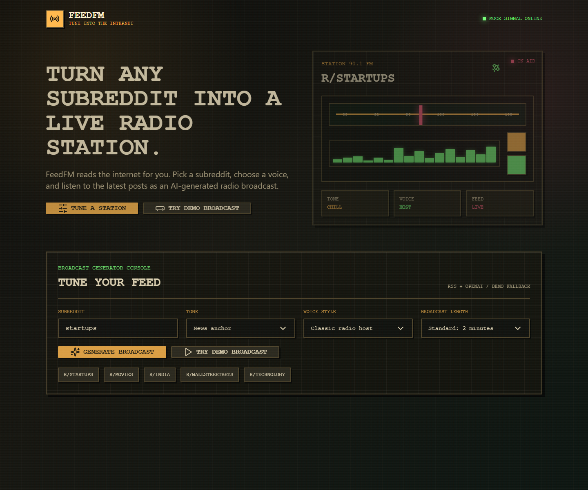
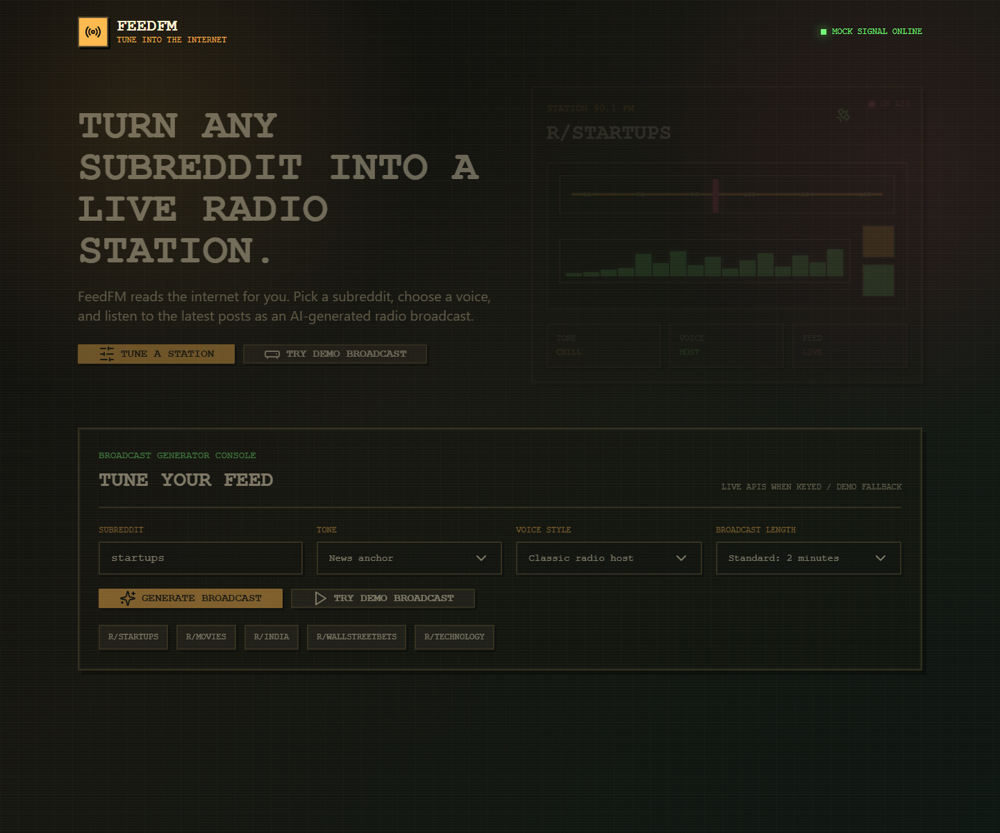

# FeedFM

FeedFM is a simple, fun web app that turns a subreddit into an AI-generated radio broadcast.

It uses public subreddit RSS feeds for post discovery, OpenAI for script/audio generation when available, and a polished demo fallback when credentials or RSS are unavailable.

## Screenshots





## Stack

- Next.js App Router
- TypeScript
- Tailwind CSS
- shadcn/ui-style components
- Framer Motion
- OpenAI Responses API for radio scripts
- OpenAI text-to-speech for MP3 playback
- Reddit public RSS feeds via `rss-parser`
- No database
- No authentication

## Environment Variables

Copy `.env.example` to `.env.local`:

```bash
cp .env.example .env.local
```

Add your OpenAI API key:

```bash
OPENAI_API_KEY=
```

Demo mode works without keys. FeedFM uses public RSS feeds for subreddit post discovery. If RSS is unavailable or blocked, the app falls back to demo data. Real AI script generation and voice playback require `OPENAI_API_KEY`; without it, FeedFM uses a mock script and transcript mode.

## Reddit RSS

FeedFM does not use Reddit API credentials, OAuth, browser automation, or HTML scraping. It reads public RSS feeds such as:

```text
https://www.reddit.com/r/startups/hot/.rss
```

## OpenAI Key

1. Create an API key in the [OpenAI dashboard](https://platform.openai.com/api-keys).
2. Add it to `.env.local` as `OPENAI_API_KEY`.
3. Keep it server-side only. Do not prefix it with `NEXT_PUBLIC_`.

## Run Locally

```bash
npm install
npm run dev
```

Open [http://localhost:3000](http://localhost:3000).

## Build

```bash
npm run build
```

## Deploy To Vercel

1. Push this project to GitHub.
2. Import the repository in Vercel.
3. Use the default Next.js settings.
4. Add `OPENAI_API_KEY` in Vercel project settings if you want real AI scripts and voice playback.
5. Deploy.

## Current Behavior

- Enter a subreddit and FeedFM cleans `r/startups` to `startups`.
- Subreddit names validate against letters, numbers, and underscores.
- `Generate Broadcast` fetches recent posts from the subreddit RSS feed.
- FeedFM prepares a clean briefing input before asking OpenAI to write the show.
- The generated output includes a title, summary, main themes, transcript, source map, and signal notes.
- The selected tone, voice style, and broadcast length influence both the script and the TTS instructions.
- If RSS or OpenAI is unavailable, FeedFM falls back to demo posts and transcript mode.
- `Try Demo Broadcast` instantly loads a polished `r/startups` demo.
